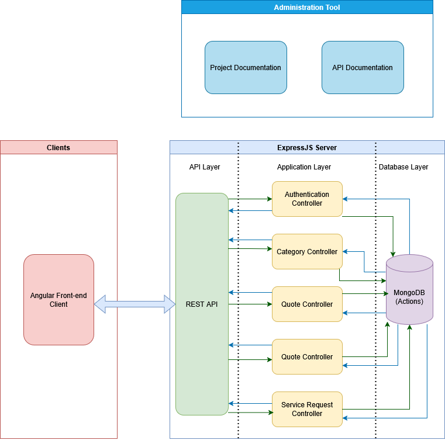

## CPAN-212-Assignment-2

Team: Abdulhamid Weheliye (n01756626, Section A), Mbaye Fall (n01764121, Section A), Cheyenne Hunsley (N01747035, Section A), Bandanpreet Kaur Malhi (n01726650, Section A), Laura Sofia Santana Acosta (N01737339,Section B)

### Project Overview

This application is full-stack MEAN web application based on the approved Buisness Requirements Document form the Neighbourhood Service Market Place.

This application allows for 
residents to:
    - Place and manage service requests
    - Create Service request categories

Providers to:
    - View service requests
    - Place quotes on service requests
    - Create Service request categories

### System Architechture
This application was built using the MEAN technology Stack

### Setup Instructions

Run start-nsm.bat

### Database Schema Explanation:

#### Quotes:
We reference ServiceRequest for requestId to ensure quotes are linked to the request they're made on
We reference User for providerId to ensure ownership is linked to the appropriate user account.

status is set as an enum to ensure only valid status values are accepted by the backend.

#### Category:
name is set to unique to ensure duplicate categories cannot be made

#### ServiceRequest:
categoryId references category to link the appropriate category to the request.

createdBy references User to ensure request ownership is linked to the appropriate user account.

status is set as an enum to ensure only valid status values are accepted by the backend.

acceptedQuoteId references Quote to ensure that the accepted quote is linked to the appropriate request.

#### User:
email is set to unique to prevent a user from making multiple accounts with the same email.

role is an enum to ensure only valid roles are accepted by the backend.

### Index Justification

#### User's email Index:
Improves search performance during user login and authentication

#### Categories's name Index:
Improves page loading performance when creating a service request

#### Service Request's Text Index on title + description:
A compound index to allow for effecient full-text search over both title and description.

#### Quotes Indexes:

##### requestId index:
This index improves query performance by preventing a full collection scan when loading quotes

##### compound requestId + providerId:
Ensures a provider can only place one quote per request.

### Api Endpoint List:

#### Auth Endpoints:
- POST /api/auth/register
- POST /api/auth/login
- POST /api/auth/logout
- GET /api/auth/me

#### Category Endpoints:
- GET /api/categories
- POST /api/categories

#### Service Request Endpoints:
- POST /api/requests
- GET /api/requests
- GET /api/requests/:id
- PATCH /api/requests/:id/status

#### Quotes Endpoints:
- POST /api/requests/:id/quotes
- GET /api/requests/:id/quotes
- PATCH /api/quotes/:id/accept
    - Uses Method B

### Role Distribution:

- Abdulhamid: Backend development
- Mbaye: Backend development
- Cheyenne: Front end development, dashboard and UI desgin, service design
- Bandanpreet: Front end development, details and my-quotes page, front end models, service design
- Sofia: Front end development, login and registration, authentication service design

### Example env files:

#### Backend env:

MONGODB_URI=mongodb://127.0.0.1:27017/nsm

PORT=3000

SESSION_SECRET=nsmsessionsecret

CLIENT_ORIGIN=http://localhost:4200

#### Frontend environments.ts:
export const environment = {
  production: false,
  apiUrl: 'http://localhost:3000/api'
};

### Example Queries:

#### Search Query:
GET http://localhost:4200/requests/69b661f97c0c95905a569238

#### Filter Query:
http://localhost:3000/api/requests?status=open&categoryId=69b5d2d142f14b20a71d8b75&q=TV

#### Login Query:
http://localhost:3000/api/auth/login
###### Request Body:
{"email":"test@gmail.com","password":"asdewq12"}

### Scalability Considerations:
As our database collections grow we would need to consider query performance and our indexing strategy to ensure queries do not become excessively slow.

As the number of requests and qoutes on the system grow, we would also need to consider the implementation of pagination to improve system performance and the UI and UX.

Our current my-quote page implementation utitlizes an inefficient method for acquiring all user created quotes. As the requests and quotes collections grow, we would need to consider creating  a dedicated endpoint for retrieving a specific user's quotes.

As the userbase grows we would also need to consider how to have our frontend UI adapt to multiple device sizes.
